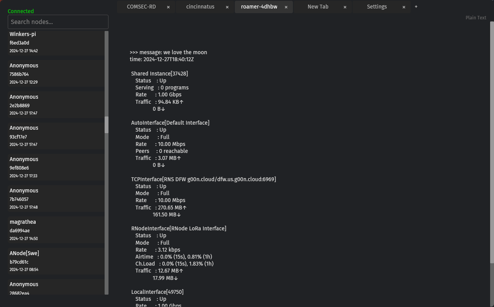

# Ren Browser (Halted)

> [!WARNING]  
> Archived in favor of a new simpler client design. Work on Ren Browser could resume in the future.



A [Reticulum](https://github.com/markqvist/Reticulum) page browser that can render `.mu` micron files on nodes and eventually also HTML+CSS files hosted on nodes. 

Uses [Iced](https://iced.rs/) GUI (Rust) and [FastAPI](https://fastapi.tiangolo.com/) backend (Python).

See [TODO.md](TODO.md).

## Features

- Micron Renderer (very bare implementation right now)
- Plain Text Renderer (fallback)
- Page Caching
- Configurable via settings (type settings in the URL bar) or .toml files (.config/ren-browser/ren-browser.toml)

## Ren API

Ren API can be used independently of the browser, add it has a backend to your project.

- Multiple Clients
- Saving nomadnet nodes and paths to JSON (moving to SQLite in the future)
- Detailed Logging

## Browser Keybindings

- `Ctrl+R` to reload a page
- `Ctrl+T` to open a new tab
- `Ctrl+W` to close a tab

more coming soon and modifiable in the future.

## Requirements
```
Python ^3.10
Rust 1.83.0
```

## Running

**API:**

Install Poetry or you can use pip.

```bash
poetry install
poetry run ren-api
```

**Iced GUI:**

```bash
cargo run
```

## Debugging

```bash
cargo run -- --debug
```

```bash
python ren_api/main.py --debug # or poetry run python ren_api/main.py --debug
```

## Poetry Scripts

```bash
poetry run format # ruff
poetry run lint # ruff
poetry run scan # bandit
```

### Libraries Used

**Python:**
```
- rns 0.8.8 (MIT)
- lxmf 0.5.8 (MIT)
- uvicorn 0.34.0 (BSD-3-Clause)
- fastapi 0.115.6 (MIT)
- pydantic 2.10.4 (MIT)
- msgpack 1.1.0 (Apache 2.0)
```

**Rust:**
```
- Iced 0.10.0 (MIT)
- reqwest 0.11 (Apache 2.0)
- serde 1.0 (Apache 2.0 / MIT)
- serde_json 1.0 (Apache 2.0 / MIT)
- tokio 1.0 (MIT)
- chrono 0.4 (MIT / Apache 2.0)
- log 0.4 (Apache 2.0)
- simple_logger 4.2 (MIT)
- toml 0.8 (MIT)
- dirs 5.0 (Apache 2.0)
```
